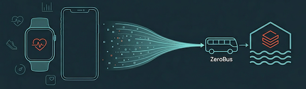
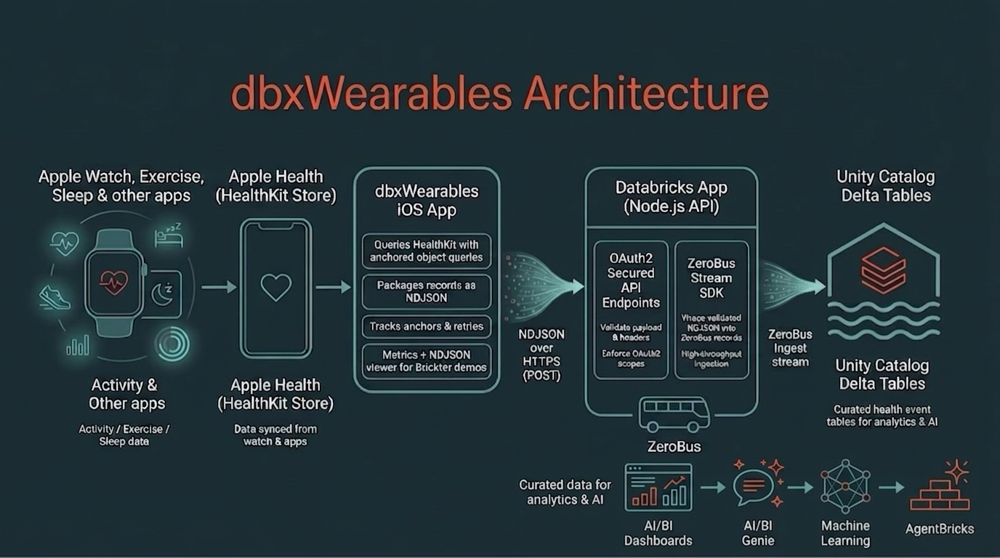

# dbxWearables

  

Use AppKit, ZeroBus, Spark Declarative Pipelines, Lakebase and AI/BI to Ingest and Analyze Wearable and Health App Data with Databricks

### HealthKit Example Architecture Diagram

  

***